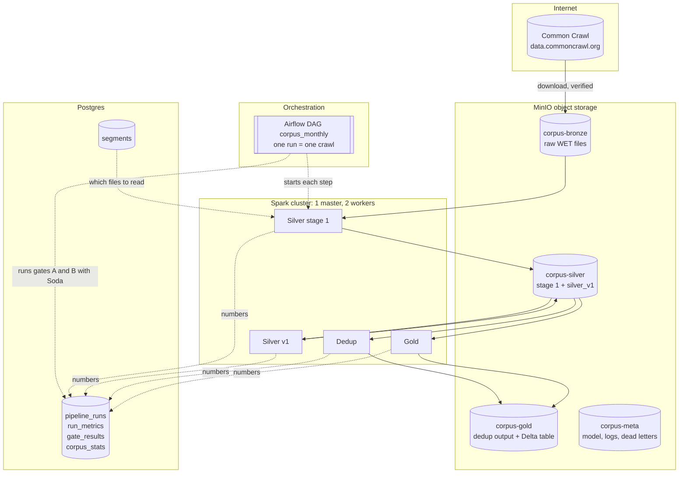

# Architecture of the Trilingual Web Corpus Pipeline

This document explains how the pipeline is built and why, in plain language. It describes the system as it exists and the numbers it produced on real data. Every number here comes from a real run of the pipeline on 50 files of Common Crawl's September 2026 crawl (CC-MAIN-2026-39), unless stated otherwise.

**Contents**

1. [What the system does](#1-what-the-system-does)
2. [The big picture](#2-the-big-picture)
3. [Where it runs: the machine and its services](#3-where-it-runs-the-machine-and-its-services)
4. [Storage: four layers, four buckets](#4-storage-four-layers-four-buckets)
5. [The control plane: Postgres as the pipeline's memory](#5-the-control-plane-postgres-as-the-pipelines-memory)
6. [Stage by stage](#6-stage-by-stage)
7. [Contracts and quality gates](#7-contracts-and-quality-gates)
8. [The rules every step follows](#8-the-rules-every-step-follows)
9. [Orchestration](#9-orchestration)
10. [Performance work](#10-performance-work)
11. [Testing](#11-testing)
12. [Packaging and environments](#12-packaging-and-environments)
13. [Security](#13-security)
14. [The numbers](#14-the-numbers)
15. [Known limitations](#15-known-limitations)
16. [Incidents and what they taught](#16-incidents-and-what-they-taught)

---

## 1. What the system does

**Input.** Common Crawl publishes, every month or so, a snapshot of billions of web pages. One of its formats, WET, holds just the text of each page (no HTML, no images), split into 100,000 compressed files of about 65 MB each. The pipeline takes a reproducible random sample of those files (50 here).

**Output.** A table of clean web pages in three languages (English, French and Modern Standard Arabic) where each page has:
- its text, normalized, with menus and footers removed and with email addresses and phone numbers replaced by `[EMAIL]` and `[PHONE]`;
- its language and how confident the detector was;
- a quality score and a tier (`high` or `medium`);
- how many copies of it existed in the crawl;
- where it came from (URL, site, fetch date, crawl).

Pages that are not in one of the three languages, too short, mostly symbols or repeated lines, or copies of another page are left out of the final table, but nothing is thrown away silently: every rejected page stays in the middle layer with the reasons it was rejected.

**Intended use.** A corpus like this is the raw material for training or evaluating language models, for search and retrieval systems, and for multilingual language research. Arabic is the focus that makes it interesting: clean, openly built Arabic web text is scarce.

**Scale.** 50 files are 0.05% of one crawl. The design does not depend on that number: the sample size is one setting, and every step is built to rerun, resume and scale out.

---

## 2. The big picture



The design follows the **medallion** pattern, in plain words: data moves through layers of increasing quality, and each layer is kept.

- **Bronze** holds the raw files exactly as downloaded. Nothing ever changes them, so any later step can be redone from the original data without downloading again.
- **Silver** holds one row per web page, cleaned and classified, rejected pages included.
- **Gold** holds only the pages worth publishing, deduplicated, in a table format (Delta) that supports safe updates and reading older versions.

Between the layers sit **quality gates**: automated checks that stop the run if the data does not meet its contract. Around everything sits a **control plane** in Postgres that records what each run intended, what it did, what it measured and what the gates decided.

One **Airflow DAG** strings the steps together:

```
acquire -> download -> gate_a -> silver -> silver_v1 -> gate_b -> dedup -> gold
```

Each box is a separate program (a "job") that can also be run by hand, and each one is safe to run twice.

---

## 3. Where it runs: the machine and its services

Everything runs on one Windows laptop (8 cores, 31.7 GB of RAM) inside Docker, with 20 GB of memory given to Docker's Linux virtual machine. Docker Compose starts nine long-running services and two one-off setup containers:

| Service | Role |
|---|---|
| `spark-master` | Hands out computing resources to Spark applications. |
| `spark-worker-1`, `spark-worker-2` | Run the actual work. Each offers 2 cores and 3 GB of memory to Spark. |
| `spark-history` | Shows finished Spark applications (stages, tasks, timings) from their event logs. |
| `minio` | Object storage speaking the S3 protocol: the four data buckets. |
| `minio-init` (one-off) | Creates the buckets, the two storage users and their access policies. |
| `postgres` | Two databases: Airflow's own, and `corpus`, the pipeline's control plane. |
| `airflow-api-server` | Airflow's web interface and API. |
| `airflow-scheduler` | Decides what runs when, and runs the tasks. |
| `airflow-dag-processor` | Reads the DAG file. |
| `airflow-init` (one-off) | Prepares Airflow's database. |

### Why a real cluster instead of Spark in one process

Spark can run inside a single process ("local mode"), which would have been simpler. A real standalone cluster was chosen because it behaves like production: work is split between separate machines, data really moves over the network when it is regrouped (a "shuffle"), and each executor shows up separately in Spark's monitoring pages. What is learned here about memory, partitions and shuffles carries over to a cloud cluster.

### Where the "driver" lives

A Spark application has one coordinating process (the driver) and several working processes (executors). Spark's standalone mode cannot run a Python driver inside the cluster, so the driver runs in **client mode**: inside the Airflow scheduler container, which is where Airflow runs the task. Executors on the workers connect back to it. Two consequences shaped the images: the Airflow image contains Java 17, the same Python (3.11) and the same pipeline package as the workers; and the driver's memory counts against the scheduler container, so only one heavy Spark job runs at a time.

### Two Python environments in the Airflow image

Airflow has its own long list of pinned dependencies; the pipeline has its own (Spark, pandas, fastText, ...). Mixing them in one environment would make every upgrade a negotiation. So the Airflow image holds **two separate environments**: Airflow's, and `/opt/corpus-venv` for the pipeline. Airflow starts each step as a command using the pipeline's Python. A third environment holds Soda (the data-quality tool), which pins its own versions of shared libraries.

### Versions

Python 3.11, Java 17, Spark 3.5.9 (from the PyPI `pyspark` package, the single source of Spark for every service and the tests), Hadoop client 3.3.4 with `hadoop-aws` 3.3.4 for S3 access, Delta Lake 3.3.3, Airflow 3.3.2, Postgres 16, Soda Core 3.5.6, MinIO release 2025-09-07. Spark 3.5 rather than 4.x was a deliberate choice: the version combination (Hadoop client, AWS SDK, Delta) was already worked out, and it matches what a Databricks long-term-support runtime offers.

---

## 4. Storage: four layers, four buckets

| Bucket | Holds | Layout |
|---|---|---|
| `corpus-bronze` | The downloaded WET files | `common_crawl/crawl_id=CC-MAIN-2026-39/segment=00042/<file>.warc.wet.gz` |
| `corpus-silver` | Silver stage 1 and silver_v1 | `_stage1/crawl_id=.../` and `silver_v1/language=.../quality_tier=.../crawl_id=.../` |
| `corpus-gold` | Dedup's decisions and the gold Delta table | `dedup/crawl_id=.../` and `gold_documents/` |
| `corpus-meta` | The language model, Spark's event logs, dead letters | `models/`, `spark-events/`, `dead_letter/silver/crawl_id=.../` |

**One place builds every path.** No part of the code assembles a storage path by itself: a single module builds them all from validated inputs (a crawl id must look like `CC-MAIN-YYYY-WW`, a segment number must be 0 to 99,999). A typo fails loudly instead of quietly creating a wrong folder, and moving to another storage system means changing one root per layer in the configuration.

**Development runs are isolated.** A quick run on 5 files writes under `_dev/` in each bucket. The leading underscore makes Spark treat those folders as hidden when it reads a table, so test data can never leak into the real tables.

### Who may write what

| Storage user | Used by | Bronze | Silver, gold, meta |
|---|---|---|---|
| `corpus-ingest` | the downloader only | read and write | no access |
| `corpus` (processing) | Spark, history server, clean-up commands | read only, with an **explicit deny** on writing and deleting | read and write |

The rule "bronze is never modified" is enforced by the storage, not by good intentions. A bug in a Spark job that pointed at the wrong folder simply gets "access denied". The explicit deny matters because a deny always beats an allow: even if someone later attaches a broader policy to the processing user, bronze stays protected. This was proven by accident during setup, when a script bug briefly gave the processing user both policies and bronze stayed protected anyway.

---

## 5. The control plane: Postgres as the pipeline's memory

The data lives in object storage; the knowledge *about* the data lives in Postgres, in the `corpus` database:

| Table | One row per | What it answers |
|---|---|---|
| `segments` | crawl and file | Which files did we intend to download, which are complete, how many attempts, what checksum, where stored? |
| `pipeline_runs` | run | When did the run start and end, did it succeed, which logic version and contract version produced its data, was it a development run, which sample (size and seed)? |
| `run_metrics` | run, stage and metric | Every number a run measured: documents in and out, rejections by reason and language, duplicate counts, file counts and sizes, Spark time and shuffle per step. |
| `gate_results` | run and gate | Did Gate A / Gate B pass, and if not, Soda's report. |
| `corpus_stats` | run, language and tier | What a run put in gold: documents, characters, words, mean length, date range. |

Design choices:

- **One run id ties everything together.** Airflow's run id is passed to every step, so a run's rows in every table share it. (A bug found in the first telemetry run, where two steps each invented their own id, led to this rule and to a check that closing a run fails loudly if no row matched.)
- **Metrics in "long" form**: one row per number. Each new metric is a new row, never a schema change, which let every later stage add its numbers without touching the database schema.
- **Upserts everywhere.** Each table has a natural key and every write is "insert or update". A retried step updates its rows instead of adding a second copy.
- **Migrations.** Schema changes are numbered SQL files applied by a small runner that remembers which ones it has applied and takes a lock, so two processes can never apply the same change twice. The files live inside the package, so they travel with it to wherever it is installed.

---

## 6. Stage by stage

### 6.1 Acquire: decide what this run is

The step downloads the crawl's list of WET files (100,000 paths), shuffles the positions with a fixed seed (42) and takes the first N. A fixed seed means the same sample every time; taking the first N of one shuffle means the 5-file development sample is exactly the first 5 of the 50-file sample. The 50 files chosen spread over 38 of the crawl's 100 internal directories, while the first 50 paths of the list would all have come from one. Each chosen file gets a `pending` row in `segments`; doing it twice inserts nothing new.

A detail worth knowing: the number in a WET file's name is not unique (each of the crawl's 100 directories numbers its files 00000 to 00999), so the pipeline identifies a file by its **position** in the list, always paired with the crawl id.

### 6.2 Download: get the files, never store a bad byte

Each file goes through: ask the server for its size and checksum → stream it to a local staging disk (resumable from where it stopped) → check the size → check the checksum (Common Crawl's ETag is the MD5 of the file for single-part uploads, so it is verified when it can be, and recorded as "not verifiable" otherwise) → decompress it completely as a test (with a cap at 4 GiB of decompressed data, so a malicious "compression bomb" cannot fill the disk) → upload under a temporary name → rename to the final name → delete the staging copy.

Only verified files ever appear under their final name. Four files download in parallel; only the main thread talks to Postgres. Claims on files expire after 15 minutes, so a crashed download is picked up again by the next run. A run stops itself if more than 10% of files fail.

**The proof.** A test starts the downloader as a real process on 10 files served slowly by a local server, kills it with `SIGKILL` (no clean-up code runs, like a power cut) once 4 files are complete, and starts it again. The result: all 10 files complete, no temporary file left behind, no file stored twice, and the 4 files finished before the kill were not downloaded again.

**Measured:** 50 files, **3,242,609,889 bytes**, all with a verified checksum, in **12 minutes 6 seconds**. Files are 63 to 68 MB compressed, about 180 MB of text each.

### 6.3 Gate A: is bronze complete?

A Soda scan over the control table: as many files registered as expected, none still pending or downloading, none failed, none without a size. Without the first check, a gate over an empty table would pass and prove nothing. A failing gate stops the DAG before anything reads bronze.

### 6.4 Silver stage 1: from files to clean pages

**Reading.** Spark reads each bronze file as one record and hands it to a Python parser (fastwarc) that walks through the pages one by one, so the 180 MB of text in a file is never held at once. The list of files comes from Postgres (exactly what Gate A validated), never from listing the bucket. Exactly one file is read per task: Spark's default packing put two files in some tasks, which ran out of memory on the full run (see section 16).

**Unreadable pages become dead letters.** A page that cannot be decoded is not allowed to kill the task: it is kept, with its error and its position in the file, in a dead-letter folder, so it can be inspected later. On the full crawl there were none.

**Normalization.** Computers compare bytes, not appearance: the same visible text can be written with different characters (a no-break space instead of a space, an accent as one character or as two, invisible zero-width characters). Every later comparison (boilerplate detection, duplicate detection) would miss those matches. So every page goes through one normalization first: invisible characters removed, Unicode compatibility folding (NFKC), line endings unified, runs of spaces collapsed, each line trimmed, line breaks kept. For Arabic, only the decorative stretching character (tatweel) is removed from the published text; see the matching key below.

**Boilerplate removal, in two passes.**
- *Line rules* drop a line if it has fewer than 4 words, if it has fewer than 10 words and no sentence ending, or if more than half of it is not letters. Arabic vowel marks are not counted against a line (fully vowelled Arabic is up to half marks). These rules act on one line at a time.
- *The site rule* drops a line that appears in more than 30% of a site's pages, and in at least 5 of them: menus, footers, legal notices. This needs to look across pages, so Spark groups line fingerprints by site (a shuffle), then sends the small list of boilerplate lines to every executor and filters each page locally (a broadcast), so the pages themselves never move between machines.

Applying the line rules before the site rule gives the same result (a line rule removes a line everywhere or nowhere) but makes the site rule's shuffle much smaller (see section 10).

**Measured (full crawl):** **1,059,107 pages**, 0 dead letters. Lines removed: 129,361,870 by the short-line rule, 33,345,711 by the no-ending rule, 330,246 by the symbols rule, 580,770 by the site rule (63,477 boilerplate lines found in 9,013 sites). 77,186 pages were left empty. Output: 50 files, 2.3 GiB. The Spark job took 334.8 seconds (342 seconds for its Airflow run).

A person read 50 pages before and after this step (20 English, 15 French, 15 Arabic, every line labelled with the rule that removed it) and judged the result acceptable.

### 6.5 Arabic: a matching key instead of rewriting the text

Web Arabic is written inconsistently: the same word appears with or without vowel marks, with different forms of alef and hamza, with ة or ه at the end, with ى or ي, with Eastern or Western digits. Folding all of these together helps comparisons but destroys information (vowelled text loses its vowels; "on" and the name "Ali" become the same word).

The design splits the two needs:
- the **published text** keeps its spelling and loses only tatweel, which carries no meaning;
- a **matching key**, computed on the fly whenever texts are compared and never stored, applies every fold: vowel marks removed, alef and hamza forms unified, ة → ه, ى → ي, Arabic and Persian digits → 0-9.

The key is used for stopword counting in the quality step and for duplicate detection. A test sweeps every basic Unicode character and checks that the key only ever changes Arabic-block characters, so it is safe to apply to any text in any language.

### 6.6 Silver v1: language, personal data, quality

A separate job reads stage 1's saved output, so changing a language, quality or personal-data rule never requires reading or cleaning bronze again.

**Language.** fastText's `lid.176` model (176 languages) labels each page with a language and a confidence. The 126 MB model is stored in the meta bucket and copied once to each executor; it is loaded once per Python worker process (4 loads of 0.2 s each for a whole run), not once per page. Spark sends only the text column to Python, in batches, and gets four small values back. A page is kept as English, French or Arabic only with a confidence of at least 0.65; below that it keeps its language but is rejected as "low confidence", so the rejection numbers can still be read per language. Egyptian Arabic is outside scope (Modern Standard Arabic only).

**Personal data.** Emails are found with a pattern. Phone numbers are found as phone-shaped pieces of text and then **validated** with Google's `phonenumbers` library for France, Tunisia and international formats; this is what keeps dates, prices and product codes from being redacted. Two problems found on real pages shaped the final version: the library's own whole-text scanner was slow (14.8 s per 3,000 pages, against 2.0 s for "find phone-shaped pieces, then validate"), and dates like 2026-09-04 are valid Tunisian mobile numbers, so anything containing a date is never treated as a phone. Matches are replaced with `[EMAIL]` and `[PHONE]`, and the page records which kinds it had. Every page goes through redaction, rejected pages included, because rejected pages are kept in silver too.

**Quality signals and tiers.** Seven signals per page: characters, words, mean word length, symbols per word (`#` and `...`), stopword ratio (with the Arabic key applied), share of repeated lines, share of lines ending in `...`. The checks follow the Gopher rules (a published set of web-text filters): 50 to 100,000 words, word length 3 to 10 (scaled for French and Arabic by their measured median word lengths), at most 0.1 symbols per word, at least 2 stopwords, at most 30% repeated lines, at most 30% ellipsis lines. Every failed check adds a reason code; the language reason comes first. A score from 0 to 1 averages five parts (length on a log scale, stopwords relative to the language's typical ratio, and the distance to three limits); a page with no reason is `high` at a score of 0.8 or more, `medium` below.

**Measured (full crawl, 12 min 38 s):**

| | English | French | Arabic | Other | Total |
|---|---|---|---|---|---|
| pages | 446,695 | 51,556 | 7,114 | 553,742 | 1,059,107 |
| high | 229,090 | 30,280 | 3,642 | 0 | 263,012 |
| medium | 67,416 | 9,893 | 1,616 | 0 | 78,925 |
| rejected | 150,189 | 11,383 | 1,856 | 553,742 | 717,170 |

Personal data was redacted on 117,729 pages (11.1%): an email on 45,725, a phone number on 86,088. The biggest filter in every language is "fewer than 50 words". Rejections by reason and language come from a single SQL statement over the silver table.

**The write.** Silver v1 is partitioned by language, then tier, then crawl, so one crawl is spread over up to a dozen folders. Rerunning a crawl must replace exactly that crawl. Overwriting the table would erase other crawls; Spark's "replace the partitions I am writing" mode would leave behind a folder the new run no longer produces (say, a tier that lost its last page). So the job deletes every folder of that crawl, then writes. The gap in between is harmless: Gate B runs after the write, and nothing downstream reads silver before Gate B has passed.

### 6.7 Gate B: is this run's silver inside its contract?

Soda only connects to Postgres here, so the silver job counts what the gate needs while it builds the data (rows read and written, nulls in columns that must never be null, kept pages with empty text, languages and tiers outside the allowed lists) and records those counts in `run_metrics`. Gate B checks them: 7 checks. **A number the job did not record reads as −1**, so a run that recorded nothing fails instead of passing silently. A test runs the real Soda scan on a clean batch (passes) and on a deliberately corrupted one (fails on exactly the three things that were broken).

### 6.8 Dedup: one page per group of copies

Dedup reads only the kept pages (341,937) and decides, for each, whether it is kept or is a copy.

**Exact copies.** A hash of the normalized text (with the Arabic key applied). Pages with the same hash are exact copies; the group keeps one.

**Which copy is kept.** One rule everywhere: highest quality score, then earliest fetch date, then smallest page id. Ending every tie-break on the page id makes the choice the same on every run.

**Near copies: MinHash and locality-sensitive hashing (LSH).** Comparing every page with every other is impossible (341,937 pages give about 58 billion pairs). The standard way around it:
1. Cut each page into overlapping 5-word sequences ("shingles"). Two pages that share most of their shingles are near copies (Jaccard similarity).
2. Summarize each page's set of shingles with **128 numbers** (a MinHash signature). The share of positions where two signatures agree estimates their similarity. The 128 hash functions use fixed coefficients derived from a seeded hash, so signatures are identical on every run and every machine.
3. Cut the 128 numbers into **16 bands of 8**. Two pages that agree on a whole band land in the same "bucket". Pages that are about 71% similar or more are very likely to share at least one bucket; dissimilar pages almost never do.
4. Only pages sharing a bucket become candidate pairs. Each candidate is then **checked on its full signature** and kept only if it reaches the same 0.71 similarity. Without that check, a few weak pairs could chain unrelated groups together.
5. Groups are found as connected components of the verified pairs (repeated "take the smallest neighbour's label" rounds, each round's result saved to cut Spark's growing plan), capped at 30 rounds.

The 16 × 8 setting was chosen over 8 × 16 on a development comparison: it found 3.6 times as many near copies (626 against 172) for about 10% more time; its 0.71 threshold is close to the 0.75 used by FineWeb, a well-known open web corpus.

Dedup's output is small and has no text: one row per kept silver page with its group, the group's size and whether it is kept (`null`), an exact copy or a near copy. Gold joins it back to silver.

**Measured (full crawl):** 4,073 exact copies (1.19%), 10,604 near copies (3.10%), **327,260 pages kept**. 409,304 candidate pairs, of which 173,470 passed the check (mean similarity 0.785). Grouping converged in 9 rounds; 6,380 groups of 2 or more pages; the largest has 786 pages from 696 different sites. Looking at the four largest groups showed what they are: short pages from hundreds of different sites whose text is mostly the same **cookie-consent banner**. The per-site boilerplate rule cannot see a banner repeated across sites; dedup catches those pages as near copies instead.

### 6.9 Gold: the published table

**Guard first.** Before reading anything, gold looks up the latest silver run of this crawl and its Gate B verdict. If Gate B failed it, never judged it, or no such run exists, gold refuses to run. This protects the published layer even when someone starts gold by hand, outside the DAG.

**Selecting pages without moving the text.** Gold first decides which pages to keep using only a few small columns (id, URL, site, language, tier, version) joined with dedup's decisions; then it reads silver once more and sends each executor the small list of chosen ids, so the 891 MB of text goes straight from silver files to gold files and is never shuffled. The whole gold job shuffled under 200 KB.

**Checks before writing.** Every kept silver page must have a dedup row and dedup must have as many rows as there are kept pages (otherwise dedup ran on an older version of silver), every row must carry the current logic version, every page must be in one of the three languages. After the write, the rows read back from the table must equal the rows selected.

**Exclusion list.** A hand-kept list of sites that asked to be left out, shipped inside the package (so every machine and environment reads the same list, and every change is a reviewed commit). An entry removes a site and all its subdomains; a blog address removes only that blog. A malformed line or a bare suffix like `co.uk` stops the run, so a typo can never let a site through silently. The list is applied before the write, as an anti-join. It is empty today; tests exclude listed sites.

**The table: Delta Lake.** Gold is a Delta table: Parquet files plus a transaction log. Each change is one small commit file listing which data files were added and which were removed. That gives three things plain files cannot:
- **atomic replacement**: rerunning a crawl removes its old files and adds the new ones in one commit, so a reader sees the old crawl or the new one, never a gap;
- **time travel**: removed files stay on storage, so an older version can be read;
- **enforced columns**: the table was created from the declared contract, and Delta itself refuses a null in a column that must not have one.

**Partitioning: language, tier, then crawl.** The plan only asked for language and tier. Adding the crawl as the last level means a rerun removes that crawl's files whole and never rewrites a file holding another crawl's rows (measured: 0 rows copied), and compaction never mixes two crawls in one file.

**Compaction and clean-up.** Each write produces many smallish files (one per reading task per partition); `OPTIMIZE` packs each partition's files into files of up to 1 GB (a maximum, not a target: a 2.6 MB partition stays one 2.6 MB file). `VACUUM` deletes files removed from the table more than 7 days ago, so any version stays readable for at least 7 days. Each VACUUM is recorded in the table's own history.

**Statistics.** After the write, gold reads its own rows back and records, per language and tier, the number of pages, characters, words, the mean length and the range of fetch dates, in Postgres.

**Measured (full crawl):** **327,260 pages** (English 283,393, French 38,687, Arabic 5,180), 1,485,642,706 characters, 236,602,046 words. 18 files (891.4 MB, average 49.5 MB) compacted to 6 (average 148.5 MB, largest 700.2 MB). About 90 seconds.

| language / tier | pages | characters | words | mean length (characters) |
|---|---|---|---|---|
| English / high | 218,980 | 1,182,087,114 | 188,588,144 | 5,398 |
| English / medium | 64,413 | 105,901,275 | 16,796,231 | 1,644 |
| French / high | 29,119 | 158,366,851 | 24,847,806 | 5,439 |
| French / medium | 9,568 | 18,760,563 | 2,986,796 | 1,961 |
| Arabic / high | 3,608 | 17,457,166 | 2,881,678 | 4,839 |
| Arabic / medium | 1,572 | 3,069,737 | 501,391 | 1,953 |

Pages were fetched between 4 and 17 September 2026.

---

## 7. Contracts and quality gates

**Contracts.** Each layer's shape is written down in code, never guessed from the data: column names, types, order, and which columns may be empty.

| Contract | Columns | Notes |
|---|---|---|
| `silver_stage1` | 10 | page, source, text, lines removed |
| `silver_v1` | 27 | adds language, confidence, signals, score, tier, reasons, personal-data flags, versions |
| `dedup_v1` | 7 | page, group, group size, duplicate type, versions |
| `gold_v1` | 17 | what a user of the corpus needs; working columns stay in silver |

Every write checks names, types and order against the contract first. Plain Parquet files cannot carry "this column is never empty", so silver proves it instead: the job counts nulls in those columns and refuses to write if any exist, and Gate B checks the count again. Gold's Delta table carries the promise itself. Each contract also has a committed snapshot; a contract can only change under a new version name (`silver_v2`, ...), and a test fails otherwise.

**Two versions on every row.** `schema_version` says which contract a row follows; `pipeline_version` says which logic produced it. The logic version is a separate constant, bumped only when a rule or threshold changes, because a bump means reprocessing every retained crawl; tying it to the package version would force reprocessing for a README change. Gold refuses rows of another logic version, so it can never mix two.

**Gates.** Gate A (bronze complete) and Gate B (silver inside its contract) are Soda scans run by one small job that records the verdict and stops the DAG on failure. Gold's own guard reads Gate B's verdict.

---

## 8. The rules every step follows

These rules are what make the pipeline safe to rerun, resume and trust:

1. **Bronze is never modified.** Enforced by storage permissions.
2. **No layer overwrites the layer before it.**
3. **Schemas are declared, never inferred, and checked before every write.**
4. **Rejected pages stay in silver, with the same columns and the same treatment** (personal data redacted too), so the rejection breakdown is always available.
5. **Normalization happens before any hashing**, so visually identical texts compare as equal.
6. **Every write is limited to its own crawl.** A rerun replaces that crawl's output and nothing else; nothing ever overwrites a whole table.

   | Layer | How a crawl is replaced |
   |---|---|
   | bronze | one object per file, written once |
   | silver stage 1, dead letters | that crawl's folder is overwritten |
   | silver_v1 | that crawl's folders deleted, then written |
   | dedup | that crawl's folder is overwritten |
   | gold | Delta replace of that crawl, in one commit |
   | Postgres | upserts keyed by run, crawl and file |

7. **Every step can be retried**: outputs, control rows and metrics alike.
8. **A failed gate stops the run and alerts.** Bad data never reaches the next layer.
9. **Gold holds one logic version.**
10. **Determinism**: seeded sampling, fixed hash coefficients, every tie-break ending on the page id, no random numbers in anything that is stored. Proven by the end-to-end run, which reproduced every count of the earlier runs exactly.

---

## 9. Orchestration

**One DAG, one crawl per run.** `corpus_monthly` runs the eight steps in order. Each step is a shell command that starts the pipeline's own Python, so the DAG file only says *what* runs and *when*; all logic lives in the package.

**Started by hand, for a chosen crawl.** The DAG has no schedule on this machine: every run is started by a person, with the crawl id as a run parameter. The parameter is checked against the `CC-MAIN-YYYY-WW` pattern when the run is triggered, so nothing else can reach the shell commands. A crawl already in bronze downloads nothing; a new crawl downloads its sample.

**Retries by kind of step.** Steps that talk to the internet (acquire, download) retry 3 times with waits doubling from 1 minute. Spark steps retry once after 2 minutes (a failed Spark job rarely succeeds on a second try, and a try can take 15 minutes). Gates never retry: a failed check is a verdict on the data, not an accident.

**One run at a time.** Delta tables on S3-style storage are only safe with a single writing process, so the DAG allows one active run; a second trigger waits.

**Time limit and alerts.** A run still going after 72 hours is failed by Airflow itself, its unfinished steps are skipped, and an alert is sent. Every failed step (after its retries) and every failed run posts one message to a Discord or Slack webhook: which DAG, run, crawl and step, the attempt, the end of the error, and a link to the log. An alert that cannot be delivered is logged and never causes a second failure. These were all tried live against a stand-in webhook: a failing step produced its two messages, a run with a 45-second limit was stopped and reported, and a run marked as failed by hand stopped its step without a retry.

**Who closes a run.** Each step opens (or reopens) the run; a failing step closes it as failed; the last step, gold, closes it as successful.

**The unattended run.** Started once from Airflow, in production mode (Section 12): all 8 steps succeeded at their first attempt in **22 minutes 5 seconds**:

| step | seconds |
|---|---|
| acquire | 4.3 |
| download | 0.6 (nothing to download) |
| gate_a | 2.6 |
| silver | 382.9 |
| silver_v1 | 624.9 |
| gate_b | 1.6 |
| dedup | 215.9 |
| gold | 87.9 |

It produced exactly the same counts as every earlier run, down to the 327,260 pages in gold.

**Reprocessing.** Rerunning a crawl means triggering it again. Reprocessing several crawls means one run per crawl; they queue one after another. After a change of logic version, every crawl in gold must be rerun; until then gold refuses to mix versions.

---

## 10. Performance work

Every Spark step records, in `run_metrics`, its wall time, number of tasks, total executor time, data shuffled, data spilled to disk and its longest task (read from Spark's own monitoring API). Every comparison below comes from those numbers or from Spark's history server. Whole-job times on this laptop vary by about 20% between identical runs, so comparisons rest on the step that changed and on counts (bytes, rows, tasks), which do not vary.

**Memory: the first full silver run (section 16).** Two fixes: exactly one bronze file per reading task, and the parsed pages kept on the executors' local disk instead of in memory. Result: 0 failed tasks, peak executor memory down from about 3 GB (crashing) to 1.8 GB.

**Filter before you shuffle.** Applying the cheap per-line rules before the site rule cut the site rule's shuffle from **294.6 MB to 54.8 MB (−81%)** on the development sample, and kept the boilerplate list under its size cap (the other order would have silently dropped 7,326 entries).

**Skew in the deduplication join.** Pages sharing a bucket are paired inside one task, and a bucket of n pages gives n(n−1)/2 pairs, so a few large buckets (the cookie banners: up to 290 pages, 41,905 pairs) make some tasks write far more than others. Measured before tuning: the 20 largest buckets produced 52% of all pairs.
- **Salting** (splitting each large bucket over several tasks, with a deterministic hash of the page id, never a random number) was built and measured: it evened out the work per task (most loaded task from 37× to 5.7× the median, with adaptive query execution off) but **bought no time** at this size, because no single bucket was big enough to make its task slow. It is kept, switched off, with the numbers that would tell when to switch it on recorded every run.
- **Adaptive query execution** (Spark merging small partitions at run time) helped the job overall (without it, label propagation went from 43.1 s to 72.1 s) and was kept on.
- **Group the band rows once.** With adaptive execution on, Spark was shuffling the 5.4 million band rows twice, once per side of the self-join (2 × 264.6 MB). Grouping them by bucket once, when they are saved, let both the bucket count and the self-join reuse that grouping: the self-join's shuffle fell to **25.2 MB**.
- **16 partitions instead of 200** for this job's shuffles: Spark's default of 200 made every step that reads a saved result run hundreds of tiny tasks (label propagation ran 4,079 tasks; with 16, 405).

**Before and after (full crawl, same results in every run):**

| | before | after |
|---|---|---|
| data shuffled, whole job | 1,666.7 MB | 1,087.4 MB (−35%) |
| data shuffled, self-join | 569.4 MB | 25.2 MB (−96%) |
| time of the steps after MinHash | 86.5-108.5 s | 55.1-57.8 s |
| label propagation | 32.6-43.1 s, 4,079 tasks | 14.6-14.7 s, 405 tasks |
| longest join task | 2.86-3.04 s | 1.75-2.34 s |
| spill | 0 | 0 |

Not tuned: the MinHash signatures themselves (60-72% of the dedup job, Python code on 4 cores).

**Gold.** The text is never shuffled (under 200 KB for the whole job). Delta's VACUUM lists the table's folders with one task per `parallelPartitionDiscovery.parallelism`, whose default is 10,000; set to 16, the compaction step went from 10,610 tasks and 39.6 s to 628 tasks and 15.6 s.

---

## 11. Testing

435 tests, run inside a Linux container built from the same image as the cluster (same Java, Spark and libraries), never directly on Windows.

| Kind | What it covers |
|---|---|
| **Unit tests** | Every transform on small hand-made data: normalization (25 tests), the Arabic key (35, including a sweep of every basic Unicode character), parsing, boilerplate rules, language assignment, quality signals and reasons, phone and email detection, exact hashing, MinHash accuracy against true similarity, banding, salting (the salted join gives exactly the same pairs as the plain one), clusters, gold selection, exclusions, Delta behaviour. |
| **Spark tests** | A shared in-process Spark session with Delta, including checks on what Spark *actually executed* (for example: the self-join on grouped rows runs no extra shuffle, read from the final adaptive plan). |
| **Integration tests** | Against the real Postgres, MinIO and Soda: the control table, downloads from a local server, the kill-and-restart proof, the storage permissions of both users, Gate A, Gate B passing a clean batch and failing a corrupted one, gold refusing a batch Gate B failed. |
| **Delta behaviour** | Time travel reads the version before a rerun; a rerun of one crawl leaves another crawl's files untouched; a null in a required column is refused and nothing lands; compaction packs one crawl's files only; VACUUM within 7 days keeps old versions readable. |
| **Golden end-to-end test** | 100 made-up pages (generated from a fixed vocabulary, so no web page or personal data is reproduced), each built to land somewhere known: kept as high or medium, rejected for one named reason, an exact or near copy, on an excluded site, with an email or phone. They go through every stage on local files, and the outcome of every page (down to a hash of its gold text) is compared with a committed expected file. It runs identically every time. |
| **Contract snapshots** | Every contract matches its committed snapshot. |
| **Alerts** | Message format for Discord and Slack, delivery to a local server, and that a missing or broken webhook never raises. |

The language model used in tests is a tiny fastText model trained in the test session on the same fixed vocabulary (the real model is 126 MB and is not in the repository).

**Continuous integration.** A GitHub Actions workflow runs the same script a developer can run locally: create a throwaway environment file, build the test image, start Postgres and MinIO, apply the migrations, lint (ruff, formatting, mypy in strict mode), check the contracts, run all tests with coverage, and build the wheel and check that it ships the files the jobs read at run time. The script uses its own Docker Compose project with no published ports, so it can run beside a developer's own stack. Rehearsed from a clean copy of the repository: every step green, 435 tests passed, 77% coverage.

---

## 12. Packaging and environments

**One package, built as a wheel.** All logic lives in the `corpus` Python package. Spark and Delta are an optional extra, because a managed Spark platform brings its own Spark. Development tools are a separate group that never ships. Exact versions are pinned in a lock file.

**Each job is also a command** (`corpus-acquire`, `corpus-download`, `corpus-gate`, `corpus-silver`, `corpus-silver-v1`, `corpus-dedup`, `corpus-gold`, `corpus-migrate`).

**Production mode and development mode.** The images install the package as a wheel, so a production run uses exactly the code baked into the images (`make up-prod`). For development, a Compose override file mounts the source folder into the scheduler and the workers and puts it first on Python's path, so an edit reaches the next job without rebuilding an image (`make up`). The unattended run above ran in production mode: the scheduler and the workers imported the package from the installed wheel.

**Configuration in one place.** Settings come from environment variables through one configuration module, with one profile per environment chosen by `CORPUS_ENV`. Secrets live only in a git-ignored `.env` file. The storage roots are settings, so storage paths do not depend on where the data lives.

---

## 13. Security

The data is text from millions of unvetted websites: untrusted input, though not executable (WET files hold extracted text only).

- **Transport and integrity:** HTTPS to Common Crawl's fixed address; size and checksum verified before storing; a cap on decompressed size against compression bombs.
- **Injection:** every database statement uses bound parameters; page text never reaches a shell; the only values in shell commands are a validated crawl id and numbers the code produced; storage paths are built only from validated values, never from page content.
- **Least privilege:** two storage users (section 4); Spark never receives the downloader's keys, and a test checks that.
- **Secrets:** only in environment variables and a git-ignored `.env`. A bug was found and fixed early: a configuration error message quoted the values it had received, including a storage secret, straight into a task log; errors now report field names only, and a test checks the secret is absent.
- **Rendering crawled text:** the review pages built for human checks escape every character of crawled text, so a `<script>` in a web page displays as text.
- **Personal data:** emails and phone numbers are redacted on every page before anything is published, rejected pages included.

---

## 14. The numbers

All from real runs on CC-MAIN-2026-39, 50 files.

| Stage | Result |
|---|---|
| Sample | 50 of 100,000 WET files, seed 42, spread over 38 of the crawl's 100 directories |
| Download | 3,242,609,889 bytes, all checksums verified, 12 min 6 s |
| Silver stage 1 | 1,059,107 pages, 0 dead letters, 77,186 emptied by boilerplate removal, 2.3 GiB |
| Silver v1 | 341,937 kept (263,012 high, 78,925 medium), 717,170 rejected, 117,729 with personal data redacted |
| Dedup | 4,073 exact copies (1.19%), 10,604 near copies (3.10%), 327,260 kept, 6,380 groups, largest 786 pages |
| Gold | 327,260 pages, 1.49 billion characters, 236.6 million words, 6 files after compaction |
| End to end from Airflow | 22 min 5 s, every step at its first attempt |
| Dedup tuning | shuffle −35% (job), −96% (self-join), steps after MinHash 86.5-108.5 s → 55.1-57.8 s |
| Tests | 435 passing, 77% coverage |

---

## 15. Known limitations

- **Small sample.** One crawl, 50 files (0.05% of the crawl). Duplicates are removed within a crawl, not across crawls.
- **Filters not validated against human labels.** Language-detection accuracy, personal-data recall and the quality filters' precision were never measured against hand-labelled samples (review pages were built, but not labelled). The language threshold (0.65) and the `high` cut-off (0.8) are untested defaults; the French and Arabic stopword lists were not checked by a speaker; near-duplicate pairs were not reviewed by a person.
- **Personal data coverage.** Emails and phone numbers (France, Tunisia, international format) only; no national ID numbers, names or postal addresses.
- **Cross-site boilerplate.** Cookie-consent banners repeated across sites survive the per-site rule; dedup removes most of those pages as near copies, but the page each group keeps is still mostly banner, and the banner's English tilts language detection on some non-English pages toward English.
- **The site rule's full-scale effect** (580,770 lines removed, part of the 77,186 emptied pages) was only reviewed by eye on the 5-file development sample.
- **MinIO images withdrawn.** The pinned MinIO images are no longer published (MinIO's community edition is now distributed as source only). The stack runs here from a local copy; a fresh machine and the GitHub Actions workflow need them supplied another way, for example built from MinIO's source at the same release tags. Until then the CI run fails when it starts MinIO.
- **One laptop.** A full run needs about 20 GB of free disk: Docker's Linux VM keeps the files it reads in memory, Windows runs short of RAM and grows its page file (measured: 2.7 to 7.7 GB during a run). Freeing the VM's file cache before a run gave Windows back about 8 GB of RAM in 20 seconds.

---

## 16. Incidents and what they taught

**The download that could not write (bronze).** The first development download failed on 4 of 5 files with a permission error: a Docker named volume is created owned by root, while the Airflow container runs as a non-root user. Everything degraded as designed: nothing reached bronze, each failure was recorded, the circuit breaker stopped the run, and after fixing the ownership a plain rerun finished the work with no manual clean-up. Lesson: a named volume takes the ownership of the image folder it covers, and only when it is empty.

**Two runs for one (telemetry).** The first telemetry showed two runs where there should be one, both stuck "running": the DAG passed its run id to one step only, and closing a run that matched no row was silently accepted. Fixed by passing the run id to every step and making that silent no-op fail loudly.

**Executors running out of memory (silver).** The first full silver run lost seven executors to Java out-of-memory errors. Two causes, found in turn: Spark packed two 65 MB files into some tasks (a size calculation mixing millions of bytes and mebibytes), and the parsed pages were cached in the executors' memory (about 1 GB each, invisible on the small development sample). Fixes: one file per task, and the cache on local disk. The full run then had 0 failed tasks. Lesson: measure at full scale; small samples hide memory problems.

**A boilerplate cap that silently dropped 84%.** At full scale the site rule found 63,477 boilerplate lines; a cap set at 10,000 to keep the broadcast small dropped 53,477 of them, though the whole set measured about 1 MB. The cap was raised to 100,000 and an "over the cap" metric now shows the moment it bites.

**Invisible characters in source code.** The editing tool turned escape sequences in test strings into the actual invisible characters; the tests still passed, but the source held characters a reviewer cannot see. Fixed by rewriting them as named escapes; files are checked for non-ASCII after editing.

**A test that checked the wrong plan (dedup).** A first attempt to make Spark reuse one shuffle for both sides of the self-join passed a unit test that looked for "reused exchange" in the plan text, but the full run still shuffled twice: the test was reading Spark's initial plan, not the plan adaptive execution actually ran. The test now walks the final executed plan, and the real fix (grouping rows once when they are saved) was verified on what actually ran. Lesson: check what really executed, never the plan's intention.

**The disk that kept shrinking.** During runs, free space on the laptop's system drive fell by gigabytes within a minute. Measured cause: not the data (Docker's disk file did not grow during a run) but memory. Docker's VM held 12.6 GB of file cache, Windows ran out of RAM and grew its page file on the same drive. The first end-to-end run was stopped safely at 4.9 GB free (nothing damaged; the step had not started writing); after freeing space the full run completed. Lesson: a pipeline's footprint includes the machine's memory behaviour, and a long run should be watched with a stop rule.

**Upstream images withdrawn.** The first GitHub Actions run failed before any test: the pinned MinIO images had been withdrawn from every public registry, which a local machine with the images cached could not reveal, not even a rehearsal from a clean copy of the repository. Lesson: a clean checkout is not a clean machine; external images are dependencies too.
