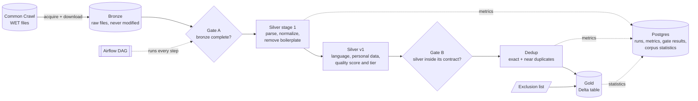

# Trilingual Web Corpus Pipeline

A batch data pipeline that turns raw web text from [Common Crawl](https://commoncrawl.org) into a clean, deduplicated, quality-tiered text corpus in **English, French and Modern Standard Arabic**, with personal data (emails, phone numbers) redacted. It runs entirely on one machine with Docker: Spark for the processing, Airflow for the orchestration, MinIO as object storage, Postgres for telemetry, Soda for data-quality gates and Delta Lake for the final table.

It was run end to end on a 50-file sample of the September 2026 crawl (CC-MAIN-2026-39): **1,059,107 web pages in, 327,260 clean pages out**, in **22 minutes** from one Airflow trigger.

For a longer, plain-language tour of how the system is designed and why, see **[ARCHITECTURE.md](ARCHITECTURE.md)**.

---

## How it works



| Step | What it does |
|---|---|
| **Acquire** | Reads the crawl's file list and draws a reproducible random sample of N files (seeded), recorded in a control table. |
| **Download** | Fetches each file, checks its size and checksum, and only then stores it in the bronze bucket. Resumable after a crash, never stores a half-written file. |
| **Gate A** | Soda checks that every sampled file is complete and valid before anything reads bronze. |
| **Silver stage 1** | Parses each page out of the raw files, normalizes the text (Unicode, invisible characters, whitespace) and removes boilerplate: menu lines, footers, and lines repeated across a site's pages. |
| **Silver v1** | Detects each page's language (fastText), redacts emails and phone numbers, computes quality signals, and gives each page a tier: `high`, `medium` or `rejected` with the reasons. Written against a declared schema. |
| **Gate B** | Soda checks the run's own numbers: rows written, schema matched, no nulls where none are allowed, no unknown values. A failure stops the run. |
| **Dedup** | Finds exact copies (hash of the normalized text) and near copies (MinHash + locality-sensitive hashing, every candidate pair verified), groups them, and keeps one page per group. |
| **Gold** | Writes the kept, deduplicated pages, minus any excluded site, to a Delta table partitioned by language, quality tier and crawl. Compacts the files, records statistics, and refuses to run on silver that did not pass Gate B. |

Every step writes only its own crawl's output: rerunning a crawl replaces that crawl and nothing else, so any step can be retried safely.

## Results (measured, CC-MAIN-2026-39, 50 files)

| | |
|---|---|
| Raw files downloaded | 50 of the crawl's 100,000 WET files, **3.24 GB** compressed, all checksum-verified |
| Pages parsed | **1,059,107**, 0 unreadable records |
| Pages in a target language that passed the quality filters | **341,937** (263,012 high, 78,925 medium) |
| Pages with personal data redacted | 117,729 (11.1%) |
| Exact duplicates removed | 4,073 (1.19%) |
| Near duplicates removed | 10,604 (3.10%) |
| **Pages in gold** | **327,260**: English 283,393 · French 38,687 · Arabic 5,180 |
| Text in gold | 1.49 billion characters, 236.6 million words |
| Gold files | 18 files (891 MB) written, compacted to 6 (one per language and tier, largest 700 MB) |
| Full run from Airflow | **22 min 5 s**, 8 tasks, all at their first attempt |

The whole chain is deterministic: every run of this crawl produced exactly the same counts and the same 327,260 pages.

**Performance work on the deduplication join** (before → after, same data): data shuffled by the whole job **1,666.7 MB → 1,087.4 MB (−35%)**; by the self-join itself **569.4 MB → 25.2 MB (−96%)**; time of the steps after MinHash **86.5-108.5 s → 55.1-57.8 s**.

## Engineering choices worth a look

- **Bronze is protected by the storage itself.** Two storage users: the downloader is the only one allowed to write raw files; the processing user (Spark) can read them and is explicitly denied writing or deleting them.
- **Kill-and-restart proof.** A test kills the downloader with `SIGKILL` mid-run and restarts it: every file ends up stored exactly once, no temporary leftovers, no finished file downloaded twice.
- **Contracts between layers.** Each layer's schema is declared in code (`src/corpus/schemas/`), checked before every write, and pinned by a snapshot test: a schema cannot change without a new version name. Gold's NOT NULL columns are enforced by Delta itself.
- **Quality gates that block.** Gate A and Gate B are real Soda scans; a failing gate stops the DAG, and gold additionally checks Gate B's verdict before reading silver.
- **Measured tuning, not guesses.** Every Spark step records its own time, shuffle, spill and longest task in Postgres, so before/after comparisons come from the runs themselves.
- **Arabic handled with care.** Lossy spelling folds (vowel marks, alef and hamza forms, teh marbuta, alef maqsura, Eastern digits) are applied only to a matching key used for comparisons; the published Arabic keeps its spelling.
- **Alerts.** A failed task or run posts one message to a Discord or Slack webhook; a run longer than 72 hours is stopped and reported.

## Tech stack

Python 3.11 · Apache Spark 3.5.9 (PySpark, standalone cluster: 2 workers × 2 cores × 3 GB) · Delta Lake 3.3.3 · Apache Airflow 3.3.2 · MinIO (S3 API, via Hadoop S3A 3.3.4) · PostgreSQL 16 · Soda Core 3.5.6 · fastText `lid.176` · fastwarc · phonenumbers · Docker Compose · uv · pytest, chispa, ruff, mypy (strict) · GitHub Actions.

## Repository layout

```
src/corpus/
  bronze/      acquire, sample, download (Common Crawl -> bronze)
  silver/      parse, normalize, boilerplate, language, quality, pii, write
  dedup/       exact hashes, MinHash, banding, clusters
  gold/        selection, exclusions, Delta write, statistics
  schemas/     the contracts between layers
  checks/      Soda gates A and B
  jobs/        one entry point per pipeline step
  metrics/     run telemetry, per-step Spark numbers
  migrations/  Postgres schema
  config/      settings per environment, exclusion list
dags/          the Airflow DAG and its failure alerts
docker/        images for Spark and Airflow, MinIO setup and access policies
tests/         unit, integration (real Postgres, MinIO, Soda), golden end-to-end test
.github/       CI workflow and the script it runs
```

## Running it locally

Prerequisites: Docker Desktop with about 20 GB of memory for its Linux VM, GNU make, and about 20 GB of free disk for a full run (plus the images).

1. `cp .env.example .env` and set every value (passwords, keys, the Airflow secrets).
2. `make up` starts the stack (Spark master, 2 workers, history server, MinIO, Postgres, Airflow). Then `make migrate`.
3. Download fastText's `lid.176.bin` from [fasttext.cc](https://fasttext.cc/docs/en/language-identification.html) (CC BY-SA 3.0) and upload it to `corpus-meta/models/` in the MinIO console (http://localhost:9001). It is not in the repository.
4. Open Airflow at http://localhost:8090, trigger `corpus_monthly` and give the crawl id (for example `CC-MAIN-2026-39`). A crawl not yet in bronze downloads 50 files (about 3.2 GB). Runs are started by hand; the DAG has no schedule.
5. Read the result through Delta, for example:

```python
from corpus.session import get_session
spark = get_session("explore")
gold = spark.read.format("delta").load("s3a://corpus-gold/gold_documents")
gold.groupBy("language", "quality_tier").count().show()
```

Always read gold through Delta: the folder also holds older versions' files (kept 7 days for time travel), so reading it as plain Parquet counts them all.

Other commands: `make test` (all tests, in a Linux container), `make lint` (ruff + mypy), `make up-prod` (runs the installed package instead of the mounted source), `make build` (the wheel).

## Tests

435 tests: unit tests on every transform; integration tests against the real Postgres, MinIO and Soda (including the kill-and-restart proof and a deliberately corrupted batch that Gate B must reject); Delta behaviour tests (time travel, a rerun replacing one crawl and leaving another untouched); and a **golden end-to-end test**: 100 made-up pages, each built to hit one rule, run through every stage and compared with committed expected output. Coverage of the package: 77%.

## Known limitations

- **One crawl, 50 files**: 0.05% of a monthly crawl. Duplicates are removed within a crawl, not across crawls.
- **Not validated against hand-labelled samples**: language-detection accuracy, personal-data recall and the quality filters' precision were never measured; the language threshold (0.65) and the `high` tier cut-off (0.8) are untested defaults.
- **Personal data**: emails and phone numbers (France, Tunisia, international format) only; no national ID numbers, names or addresses.
- **Cross-site boilerplate**: cookie-consent banners repeated across many sites survive the per-site boilerplate rule; they form the largest near-duplicate groups.
- **MinIO images withdrawn upstream**: the pinned images (`quay.io/minio/minio:RELEASE.2025-09-07T16-13-09Z`, `quay.io/minio/mc:RELEASE.2025-08-13T08-35-41Z`) are no longer published by MinIO, whose community edition is now distributed as source only. A fresh machine, and the GitHub Actions workflow, need those images supplied another way (for example built from MinIO's source at the same release tags); until then the CI run fails at the step that starts MinIO.
- **Hardware**: tuned for one laptop. A full run needs about 20 GB of free disk, because Windows grows its page file while Docker's VM uses most of the memory.
